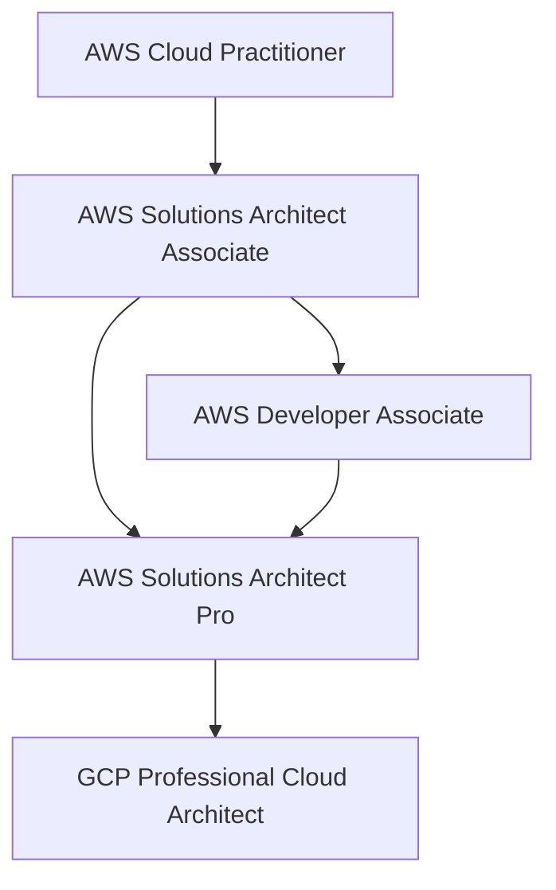
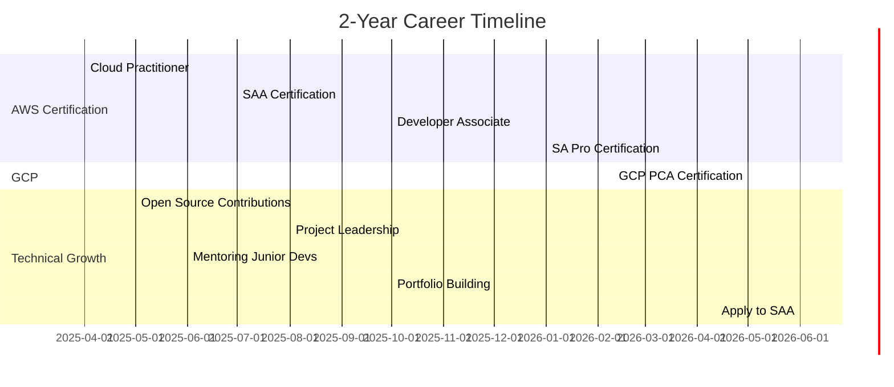
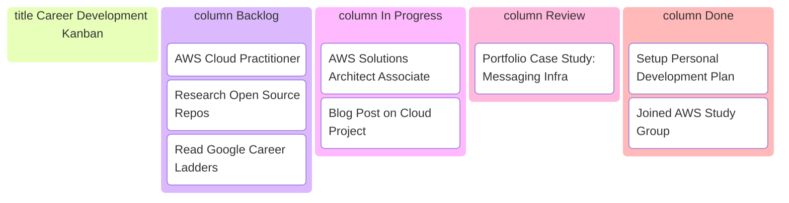

## 🎯 Career Vision

### 🌟 Long-Term Aspiration
Become a **Staff Software Engineer** and later a **Solution Architect Specialist**, with deep expertise in **AWS**, **Google Cloud**, and strong open-source/community involvement in **JAMStack** ecosystems.

### 🧠 About Me
**Senior Software Engineer | JavaScript & TypeScript Specialist | Backend-Focused | Scalable Systems & Cloud Architecture**

I’m a Full-Stack Engineer with a decade of experience and I deeply specialize in JavaScript and TypeScript. My primary focus is backend development, where I design scalable systems, architect APIs, and integrate cloud infrastructure. I also bring solid frontend experience to deliver consistent, full-stack solutions from database to interface.

I have hands-on expertise with Node.js, Next.js, and Remix, along with modern technologies like server actions, edge functions, and React Server Components. On the data side, I’ve worked with relational databases such as PostgreSQL and MySQL and cloud-native options like DynamoDB and CosmosDB. I’m also experienced with tools like Prisma and Drizzle ORM to keep codebases clean and maintainable.

My career has been marked by impactful contributions: reducing infrastructure costs through better backend architecture, improving application performance and reliability through thoughtful refactoring, and accelerating delivery timelines by introducing modern tooling and processes. I care deeply about writing clean, testable code and building robust, easy-to-evolve systems.

Fluent in English at a certified C2 level and based in Brazil, I bring strong communication skills, teaching experience, and a collaborative mindset to every team I work with. I’m passionate about solving meaningful technical problems, mentoring others, and continuously growing my craft.

---

## 🎯 SMART Goals

### Short-Term (6–12 months)

1. **Get AWS Cloud Practitioner Certified**
   - *Specific*: Pass the AWS Cloud Practitioner exam
   - *Measurable*: Achieve a score of 800+ on the exam
   - *Achievable*: Complete official course and take 5+ mock exams
   - *Relevant*: Foundation for AWS certifications path
   - *Time-bound*: Complete by June 2025

2. **Get AWS Solutions Architect Associate Certified**
   - Study architectural best practices, complete 300+ practice questions
   - Complete by September 2025

3. **Contribute to 3 OSS Projects**
   - Find and engage with repos related to Node.js or TypeScript
   - Make at least 3 PRs that get merged
   - Complete by December 2025

4. **Lead a Project with Observability & Release Planning**
   - Own a feature or service lifecycle with full monitoring and feature flag strategy
   - Document observability stack and post-release analysis
   - Deliver by October 2025

5. **Mentor a Junior Engineer**
   - Offer bi-weekly sessions
   - Track mentee progress and share feedback with management
   - Ongoing, starting June 2025

### Long-Term (1–2 years)

1. **Get AWS Developer Associate Certification**
   - Focus on CI/CD, serverless, monitoring tools
   - Complete by December 2025

2. **Get AWS Solutions Architect Professional Certification**
   - Deep dive into complex architecture case studies
   - Complete by April 2026

3. **Get GCP Professional Cloud Architect Certification**
   - Practice with Qwiklabs and real GCP deployments
   - Complete by July 2026

4. **Promotion to Staff Engineer**
   - Drive multi-team initiatives, support junior devs
   - Formal review + feedback cycle
   - Target by Mid-2026

5. **Build a Public Portfolio of Architecture Case Studies**
   - Write 3+ detailed blog posts or talks
   - Include visuals, tradeoffs, metrics
   - Ongoing, publish first by Dec 2025

6. **Apply to Google and similar top-tier companies**
   - Prepare Leetcode/FAANG interviews, refine resume
   - Apply by Mid-2026

---

## 🛠️ Action Plan

| Goal | Action Steps | Timeline | Resources |
|------|--------------|----------|-----------|
| AWS Cloud Practitioner | Take official AWS course, complete quizzes | Apr–Jun 2025 | AWS Training, ExamPro |
| AWS SAA | Take Architect course, complete practice exams | Jul–Sep 2025 | AWS Learning Path |
| AWS Developer Associate | Start after SAA, hands-on with Lambda, CI/CD | Oct–Dec 2025 | Whizlabs, AWS Docs |
| AWS SA Pro | Study real case studies, exam questions | Jan–Apr 2026 | Stephane Maarek, Community |
| GCP PCA | Enroll in Coursera/GCP course, lab practice | May–Jul 2026 | Coursera, Qwiklabs |
| Open Source | Contribute to Node.js/React/TS repos | Starting May 2025 | GitHub, goodfirstissues.dev |
| Staff Promotion | Own multi-team initiative and document outcomes | By mid-2026 | Manager feedback, reviews |
| Architect Portfolio | Document infra & app designs w/ Mermaid diagrams | Ongoing | Real projects, Docusaurus |

---

## 📋 Certification Tracker

| Certification | Status | Target Date | Notes |
|---------------|--------|-------------|-------|
| AWS Cloud Practitioner  | In Progress | Jun 2025 | Foundation for cloud learning |
| AWS Solutions Architect Associate | Planned | Sep 2025 | Core AWS knowledge |
| AWS Developer Associate | Planned | Dec 2025 | DevOps and CI/CD focus |
| AWS SA Professional      | Planned | Apr 2026 | Deep architecture certification |
| GCP PCA                  | Planned | Jul 2026 | Multi-cloud foundation |

---

## 🔁 Certification Pathway (Mermaid Flow)

---

## 📊 Career Timeline (Mermaid Gantt Chart)

---

## 📌 Kanban Tracker (Mermaid Board)

---

## 📌 Career Planning Best Practices (Inspired by Big Techs)

- **Set SMART Goals**: Clear objectives that are Specific, Measurable, Achievable, Relevant, and Time-bound
- **Use a Personal Career Doc**: Maintain a living document like this to reflect, realign and document wins
- **Frequent 1:1s**: Use meetings with your manager to align progress, highlight growth, and course-correct if needed
- **Build a Brag Document**: Log your achievements quarterly (code contributions, mentorship, project ownership)
- **Mentor and Be Mentored**: Take and give mentorship as a growth multiplier
- **Study Internal Ladders**: Look at frameworks like Google’s [Eng Ladder](https://levels.fyi) for expectations by level
- **Communicate Impact**: Share how your work moves the business or team forward
- **Prepare for Interviews Always**: Keep coding, system design and behavioral prep fresh
- **Set Quarterly Goals**: Use OKRs or personal goal reviews to stay on track

> “You don’t need to have it all figured out, but you do need a map.”

